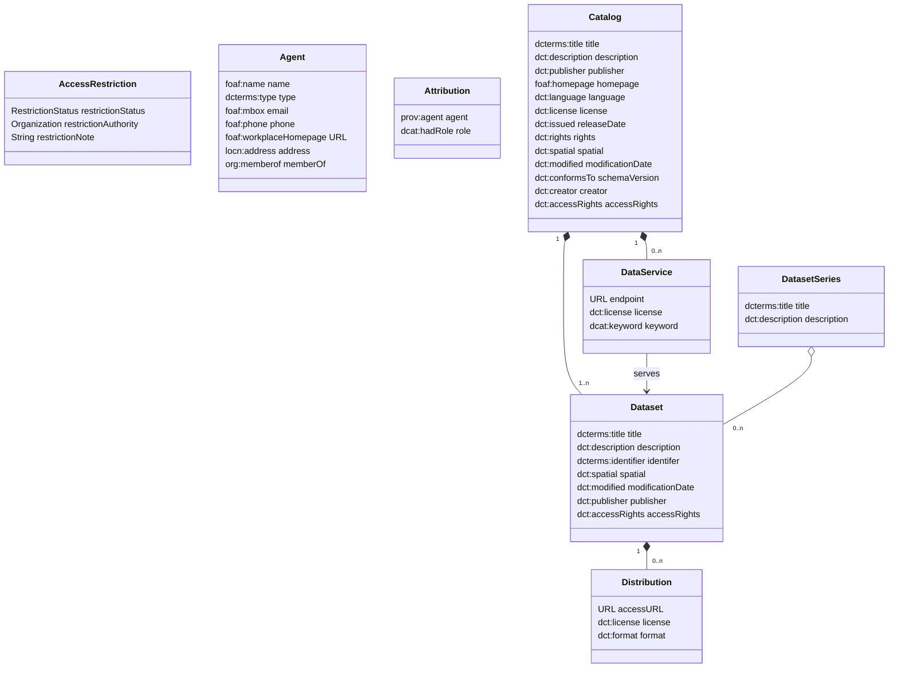

```mermaid
  classDiagram

  class AccessRestriction {
    RestrictionStatus restrictionStatus
    Organization restrictionAuthority
    String restrictionNote
  }

  class Agent {
    foaf:name name
    dcterms:type type
    foaf:mbox email
    foaf:phone phone
    foaf:workplaceHomepage URL
    locn:address address
    org:memberof memberOf
  }

  class Attribution {
    prov:agent agent
    dcat:hadRole role
  }

  class Catalog {
    dcterms:title title
    dct:description description
    dct:publisher publisher
    foaf:homepage homepage
    dct:language language
    dct:license license
    dct:issued releaseDate
    dct:rights rights
    dct:spatial spatial
    dct:modified modificationDate
    dct:conformsTo schemaVersion
    dct:creator creator
    dct:accessRights accessRights
}

class DataService {
  URL endpoint
  dct:license license
  dcat:keyword keyword
}

class Dataset {
  dcterms:title title
  dct:description description
  dcterms:identifier identifer
  dct:spatial spatial
  dct:modified modificationDate
  dct:publisher publisher
  dct:accessRights accessRights
}

class DatasetSeries {
  dcterms:title title
  dct:description description
}

class Distribution {
  URL accessURL
  dct:license license
  dct:format format
}

Catalog "1" *-- "1..n" Dataset
Catalog "1" *-- "0..n" DataService
Dataset "1" *-- "0..n" Distribution
DataService --> Dataset : serves
DatasetSeries o-- "0..n" Dataset
```
